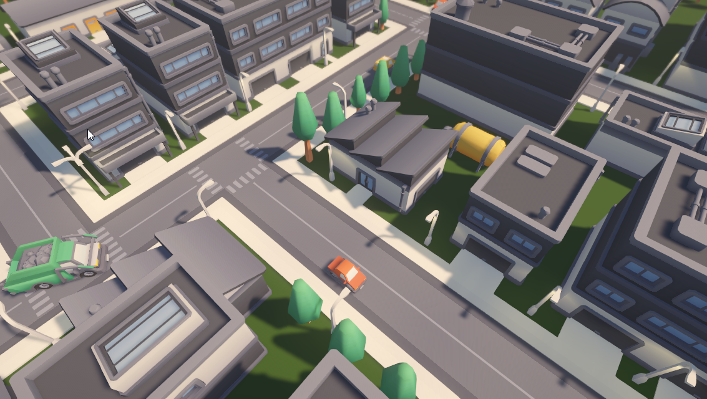
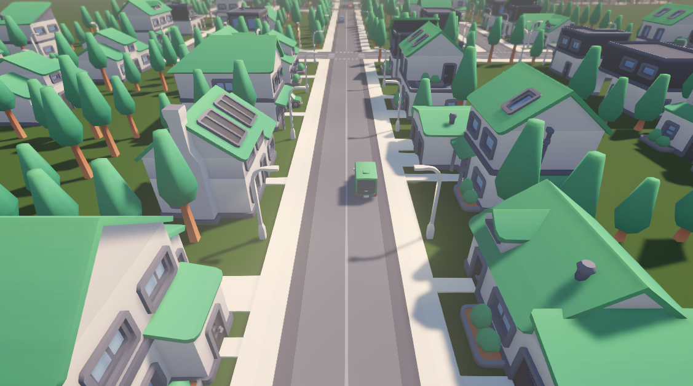
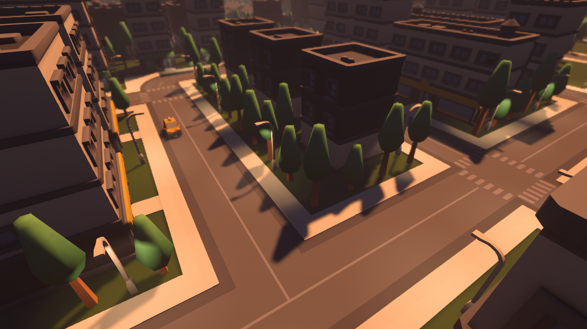
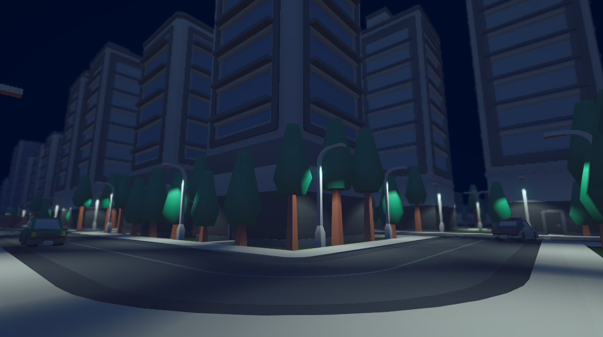

# Community Core Stack — City 02

> A complete, ready-to-use city built on [Kenney](https://kenney.nl) CC0 assets.  
> Free forever. No strings attached.

---

## Previews

<table>
  <tr>
    <td></td>
    <td></td>
  </tr>
  <tr>
    <td></td>
    <td></td>
  </tr>
</table>

---

## What is this?

**City 02** is the second release under the **Community Core Stack** initiative — a growing library of high-quality, CC0-licensed Unity environments built for the entire game dev community.

The goal is simple: give developers a polished, realistic city they can drop into any Unity project without worrying about licensing, attribution, or cost. Personal projects, commercial games, tutorials, game jams — all covered.

This city was hand-crafted as part of the course [**"How to Create your own Cities in Unity"**](https://www.udemy.com/course/game-dev-creative-cities-in-unity/?referralCode=833821B2C9F21ABB09DF) using [Kenney's 3D asset packs](https://kenney.nl/assets) and includes:

- Three **ready-to-use scenes**: Day, Sunset, and Night lighting variants
- A city layout built with Kenney's **City Kit** (Roads, Commercial, Industrial, Suburban)
- **Blocky Characters** and vehicles to populate the streets
- Post-processing profiles for each time-of-day atmosphere
- Universal Render Pipeline configured for PC

---

## Scenes

| Scene | Description |
|---|---|
| `City - 02 - Day.unity` | Full daylight scene |
| `City - 02 - Sunset.unity` | Golden-hour atmosphere |
| `City - 02 - Night.unity` | Night scene with street lighting |

---

## License

**CC0 — No Rights Reserved.**

All source assets are from [Kenney.nl](https://kenney.nl), released under CC0. This project inherits the same license. You can use, modify, and distribute everything here — commercially or otherwise — without asking for permission.

No credit required. Though it's always appreciated.

---

## Getting Started

### Requirements
- Unity **2022.3 LTS** or newer (URP recommended)

### Import

1. Clone or download this repository
2. Open Unity Hub and add the project folder
3. Open any scene under `Assets/` (`City - 02 - Day`, `Sunset`, or `Night`)
4. Hit Play

That's it. No package setup, no paid dependencies.

---

## What is Community Core Stack?

Game development moves faster when the community builds together.

**Community Core Stack** is an open initiative to produce high-quality, ready-to-use Unity environments that anyone can pick up and build on. City 01 was the first entry — City 02 continues the series with a fresh layout and three lighting variants.

If you want to contribute a scene, improve an existing one, or just follow along, open an issue or reach out directly.

---

## Course

This city was built during the Udemy course:

**[How to Create your own Cities in Unity](https://www.udemy.com/course/game-dev-creative-cities-in-unity/?referralCode=833821B2C9F21ABB09DF)**

---

## Author

Made by **lucspinto**  
Part of the *Game Dev Creative* series — focused on the visual and creative side of Unity game development.

- LinkedIn: [linkedin.com/in/lucspinto](https://www.linkedin.com/in/lucspinto)
- GitHub: [github.com/lucspinto](https://github.com/lucspinto)
- Website: [Podnerado Game Dev](https://web-ponderado-game-dev.vercel.app/)
- Courses: [Udemy Courses](https://www.udemy.com/user/lucas-r-pinto/)
